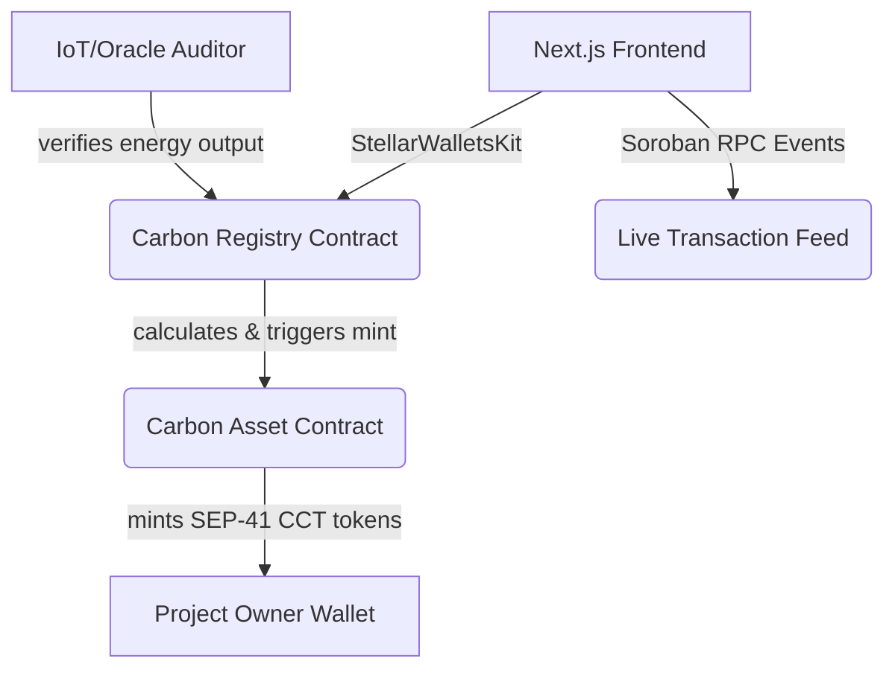

# Stellar Carbon Registry 🌿

A production-ready Soroban Smart Contract DApp for the Stellar Ecosystem that tackles double-counting and greenwashing in the carbon offset market. It leverages IoT and real-world Oracle data to dynamically mint verifiable Carbon Credit Tokens (CCTs).

## Product Overview & Problem Statement

**The Problem:** The current carbon offset market is plagued by double-counting, lack of transparency, and greenwashing. Manual ledgers are easily manipulated.

**The Solution (Our Twist):** The Stellar Carbon Registry connects real-world data (simulated via an Auditor role representing IoT sensor data like solar output) directly to a Soroban smart contract to dynamically mint carbon credits. Every carbon credit represents a fully transparent, verifiable on-chain asset whose entire lifecycle—from data verification to credit minting—can be audited in real-time.

---

## 🏗 Architecture

### Mermaid Diagram


### Smart Contract Design & Inter-Contract Communication
1. **`carbon_registry`:** The core orchestrator. Manages access control (RBAC), registered projects, and verified data. Contains the `verify_data` method that only authorized Auditors can call.
2. **`carbon_asset`:** A SEP-41 compliant token representing the Carbon Credit.
3. **Flow:** When a project owner calls `mint_credits` on the Registry, the Registry verifies the available audited data and executes a **cross-contract call** to the `carbon_asset` contract to securely mint the exact amount of corresponding tokens.

### Tech Stack
- **Smart Contracts:** Rust, Soroban SDK
- **Frontend:** Next.js 15 (App Router), TypeScript, Tailwind CSS, shadcn/ui
- **Wallet & State:** StellarWalletsKit, Zustand, React Query
- **Observability:** Soroban RPC Event Streaming (Simulated live feed via Zustand polling)
- **CI/CD:** GitHub Actions

---

## 💻 Local Dev & Environment Setup

### 1. Prerequisites
- [Rust](https://www.rust-lang.org/tools/install) + `wasm32-unknown-unknown` target
- [Stellar CLI](https://developers.stellar.org/docs/tools/cli)
- Node.js v20+

### 2. Smart Contracts (Soroban)
```bash
cd contracts
# Build contracts
cargo build --target wasm32-unknown-unknown --release
# Run tests
cargo test
```

### 3. Frontend
```bash
# Install dependencies
npm install
# Setup env vars
cp .env.example .env.local
# Run development server
npm run dev
```

---

## 🚀 CI/CD & Deployment

This repo includes a `.github/workflows/ci.yml` file that automatically runs:
- Rust smart contract tests.
- Next.js frontend builds.

### Deployment Script
Run the automated deployment script to deploy to the Stellar Testnet:
```bash
chmod +x deploy.sh
./deploy.sh
```

## 🚀 Live Testnet Deployment

The smart contracts have been successfully deployed and initialized on the Stellar Testnet!

- **Carbon Asset Contract (CCT):** `CBOKOZTX6BZHWX2RJ6VIIY3PQ6L6ZYR6VCEIHBGYN2Z4Y4KAVHAGTARZ`
- **Carbon Registry Contract:** `CCJ5AVMGK3OSA5SKAYQY622RXDSUVRO3QG74YCGZVYBKIWUVIDRWW5KS`

### 🔗 Real Transaction Hashes (Explorer Links)
- **Deploy Carbon Registry:** [c617592cd04a56dde4a17d6b9bf39b67efb3491fd57fd94abcef9a4a8f592928](https://stellar.expert/explorer/testnet/tx/c617592cd04a56dde4a17d6b9bf39b67efb3491fd57fd94abcef9a4a8f592928)
- **Initialize Registry:** [98ee5d8546d3308d61104f93a81b988e3b16ffcc3b71a593f9b96f408a8d68a2](https://stellar.expert/explorer/testnet/tx/98ee5d8546d3308d61104f93a81b988e3b16ffcc3b71a593f9b96f408a8d68a2)
- **Initialize Asset (CCT):** [8a17a35bd32808b0960c843abb883b148548ee86f0f42d8faf62505ab6d7f4e3](https://stellar.expert/explorer/testnet/tx/8a17a35bd32808b0960c843abb883b148548ee86f0f42d8faf62505ab6d7f4e3)

---

## 🔒 Security Considerations
1. **Access Control:** The asset contract strictly requires `require_auth()` from the Registry contract to mint or burn tokens.
2. **RBAC:** Auditors must be whitelisted by the Admin to report real-world data, preventing malicious data entry.
3. **State Integrity:** Projects can only mint credits up to the mathematically verifiable limit of their audited environmental data.

---

## 📸 Screenshots


-------------------------------------------------------------------------------------------------------------------------------------------------------------------


-------------------------------------------------------------------------------------------------------------------------------------------------------------------

- 

-------------------------------------------------------------------------------------------------------------------------------------------------------------------


 ------------------------------------------------------------------------------------------------------------------------------------------------------------------

 

 ## 👨‍💻 Author

**Ranit Sarkar**

Blockchain Enthusiast | Aspiring Developer

Profile link : https://github.com/ranitsarkar5


## 📄 License

MIT License


